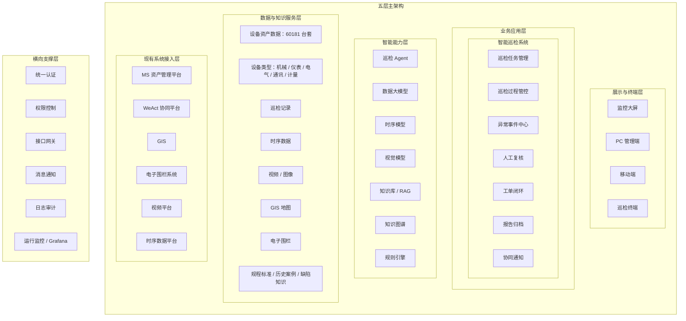

# 智能巡检系统分层架构图

本文用于 PPT 汇报架构图取材，只表达分层关系与核心模块，不展开实现细节。

## 分层架构图

## 汇报口径

- 上层是业务使用入口，下层是数据与系统支撑。
- `智能巡检系统` 是业务主平台，承接任务、异常、复核、工单和归档。
- `智能能力层` 提供 Agent、模型、知识库、知识图谱和规则能力。
- `现有系统接入层` 体现接入 MS、WeAct、GIS、电子围栏、视频和时序平台。
- `横向支撑层` 体现生产落地所需的权限、网关、消息、审计和监控能力。
