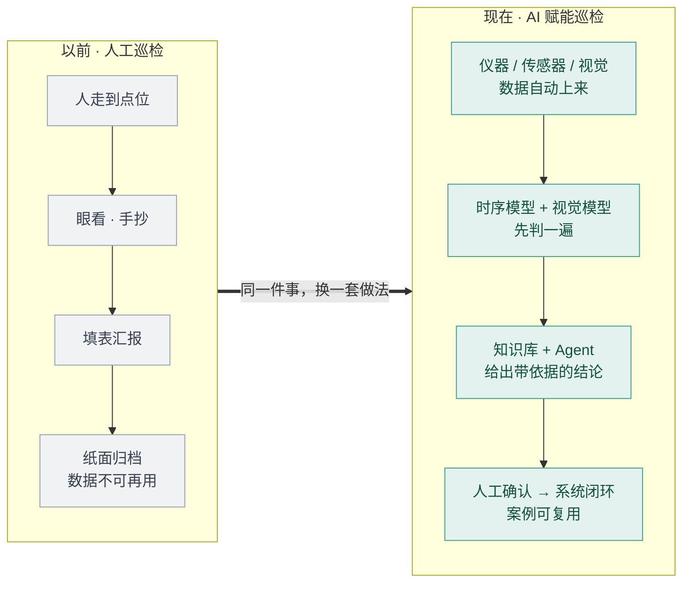
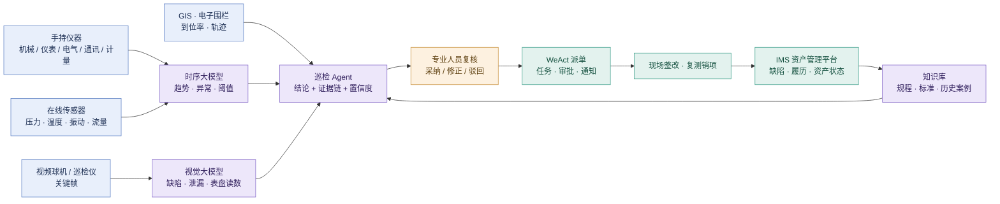
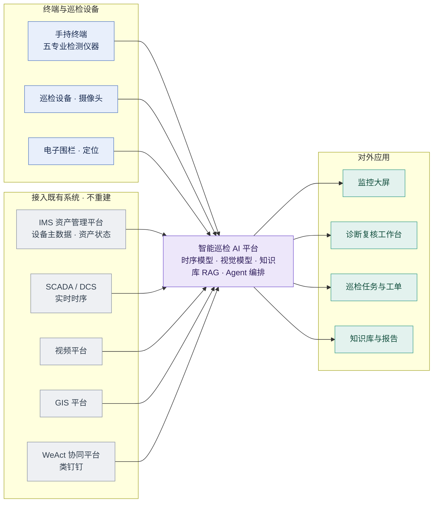

# 智能巡检 AI 赋能架构

**同一件巡检，换一套做法。** 以前靠人走、眼看、手抄、填表汇报；现在数据自己上来，模型先判一遍，Agent 配上规程依据给出结论，人只做确认，结果回写既有系统并沉淀成下次可复用的案例。

AI 在这套逻辑里的定位是**提建议**，人始终是**定终态**的那一环——这是它能在生产上跑、而不是只能演示的前提。

---

## 图 1 · 变的是什么

| | 以前 | 现在 |
|---|---|---|
| 数据怎么来 | 人填表 | 仪器 / 传感器 / 视觉自动采集 |
| 谁先发现问题 | 靠个人经验 | 时序模型 + 视觉模型 |
| 结论有没有依据 | 口头经验 | 知识库引用规程与历史案例 |
| 结果去哪了 | 纸面归档 | 回写 IMS，沉淀进知识库 |

---

## 图 2 · 业务主链路：数据从哪来，谁来判，谁说了算

**三句话讲完这张图**

1. **左边：数据入口不再是人填表。** 五个专业的手持仪器、在线测点、视频关键帧、GIS 与电子围栏，都是自动上来的数据。
2. **中间：三个模型加一个 Agent。** 时序模型看趋势、视觉模型看画面、知识库给规程依据，Agent 把它们合成一条带证据链和置信度的结论。
3. **右边：闭环不另建系统。** 复核结论走 WeAct 派单审批，整改销项后回写 IMS 的缺陷与履历，处置结果回流知识库，下次相似问题直接命中。

---

## 图 3 · 系统接入：AI 平台怎么挂到既有系统上

**落地上的三个硬约束**

- **接入而非替换。** IMS、WeAct、SCADA、视频、GIS 保持原样，AI 侧单向取数，只在两个明确约定的口子回写：缺陷与工单回 IMS，任务与提醒回 WeAct。
- **结论必须可追溯。** 模型输出强制携带测点、关键帧、规程条目的引用；没有引用不允许进入复核队列。
- **人是终态唯一入口。** AI 结论停在「建议」状态，复核人采纳后才生成工单；先跑只读提醒并行验证，达标后再开自动派单。

---

## 待确认的口径

图上这几处直接影响评审问答，需要业务侧核一遍：

- **设备规模与分类**：60181 台套、5 大类，与「机械 / 仪表 / 电气 / 通讯 / 计量」是同一套分类，还是设备分类与专业分工两个不同维度？确认后补到图 3 的 IMS 节点上。
- **IMS / WeAct 集成深度**：现按「IMS 单向取数 + 缺陷回写、WeAct 双向」画，是否与实际接口权限一致。
- **时序数据来源**：直连 SCADA / DCS，还是经 IMS 或中间平台转发。

> 现有的 4 个演示页面（监控大屏 / 站点态势 / 诊断台 / 知识图谱）是这套逻辑的可视化样例，用于评审现场演示，不构成上述架构的一部分。
